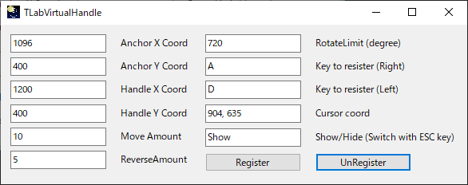

# TLabVirtualHandle
Operation aids for playing car games comfortably on LDPlayer.  
Handle operations using the mouse can be assigned to the keyboard.  
Operation verified by CarParking.

## Screenshot
</img>  
</img>  
</img>

## Note
- Some of the UI, such as pop-up windows, is currently in Japanese. An English version will be released in the future.
- The smaller the MoveAmount and the larger the RotateLimite, the longer the system monopolises control of the mouse. Please use caution when configuring the settings, as the escaping process is currently not yet implemented.
